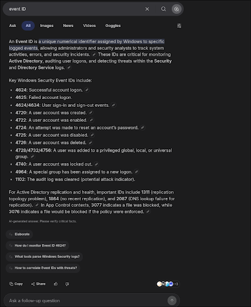
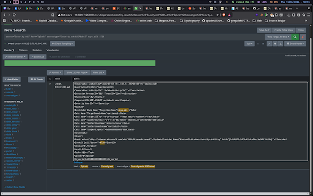

# WriteUp - Accountador

## Overview

* **Name:** Accountador
* **Category:** SoC
* **Point:** 500
* **Author:** Aseng
* **Desc:** You need to use SIEM to solve this challenge, otherwise you get 0. Which account that creates the user daya.aili and what event ID occurs on that user creation?
* **File:** [Security.zip](../SoC/Security.zip)
* **Answer =** LKS{domain\nameaccountlowercase_eventidnumber}
* **Example =** LKS{setiabudi\bukalapakacc_1337}

## Summary
* **Find out which account created the user daya.aili.**
* **Look up the Event ID for that event.**
* **Searching for the domain associated with that account.**

## Attack Idea
First, Converting evtx files to .xml<br>
Tool used:
>  

repo link: https://github.com/williballenthin/python-evtx

result:
> 


**Analysis:** <br>
The Event ID used is definitely 4720 based on the information obtained:
> 

**#Disclaimer**: We use Google Summary, a legal feature (which, by the way, has been authorised by the organising committee).
“4720: A user account was created.”

Next, enter this query into the Splunk filter:

`` daya.aili 4720
``
````
source="Security.xml" host="Splunk" sourcetype="Security.evtxLKSPbabel" daya.aili 4720
````
>  

The account name is Administrator (very typical of Windows). You can see through the log.

<b>FLAG
----
LKS{setiabudi\administrator_4720}</b>

