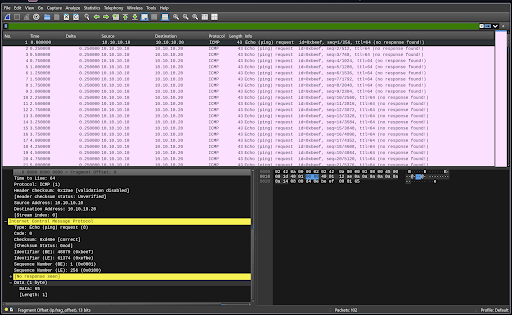
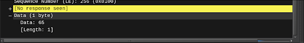
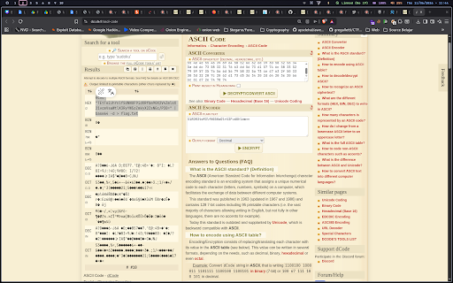
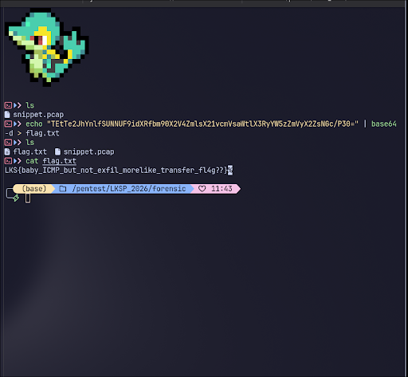

# WriteUp - Pinging

## Overview

* **Name:** Pinging
* **Category:** Forensic
* **Point:** 500
* **Author:** Aseng
* **Desc:** My buddy sends me something inside that ICMP protocol data, can you parse and help me figure out what’s the message?
* **File:** [snippet.pcap](../forensic/snippet.pcap)

## Summary
* **Looking for hidden messages within ICMP**

## Attack Idea
When I scroll using the Page Down key, I suspect that some characters in the Data table are changing.
> 
> 

Then, I write all the text appear on that table one by one (manualy).

>  

Here, I am using dcode.fr for automatic analysis and decryption.
Then I got this:
>  

<b>FLAG:
----
LKS{baby_ICMP_but_not_exfil_morelike_transfer_fl4g??} </b>

