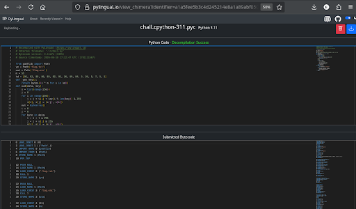
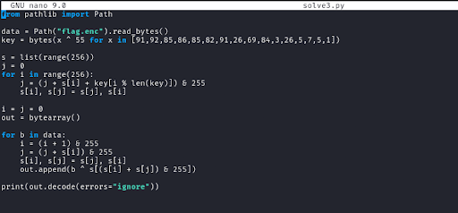
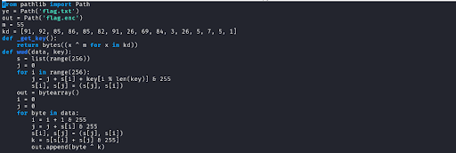
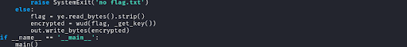
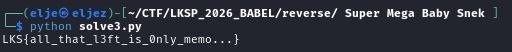

# WriteUp - Super Mega Baby Snek

## Overview

* **Name:** Super Mega Baby Snek
* **Category:** Reverse Engineering
* **Point:** 500
* **Author:** aseng
* **Desc:** Just a very very baby simple encryptor, this one is a warmup intead of ez zz. 
* **File:** [SuperMegaBabySnek.zip](../rev/SuperMegaBabySnek.zip)

## Summary
* **Decrypt the encrypted python.**
* **Disasamble the python encrypted flag to python decryptor enc flag.**

## Attack Idea
Here, we use online tools to decrypt the content:
> 
> 
> 

We changed `ye` and `out` to `data = Path("flag.enc").read_bytes()` because the encrypted output is no longer `flag.txt`; we also shortened `m`, `kd` and `def` to `key = bytes(x ^ 55 for x in [...])`Then, for the function: `def wud(data, key):`, we removed the wrapper and placed the contents directly in the main script
>  

section:  
flag = ``ye.read_bytes().strip()``  
encrypted = ``wud(flag, _get_key())``  
``out.write_bytes(encrypted)``  

we chnaged it to be:decrypt+print:  
``out.append(b ^ s[(s[i] + s[j]) & 255])``  
``print(out.decode(errors="ignore"))``  
and the result of modifying the script:  ``LKS{all_that_l3ft_is_0nly_memo...}``
 

<b> FLAG:
----
LKS{all_that_l3ft_is_0nly_memo}</b>
