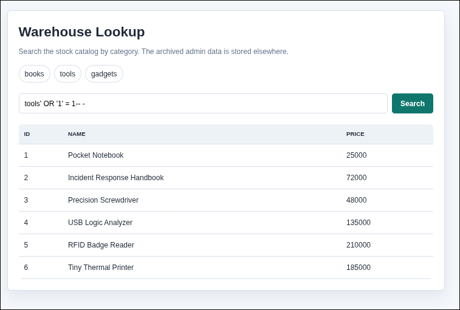
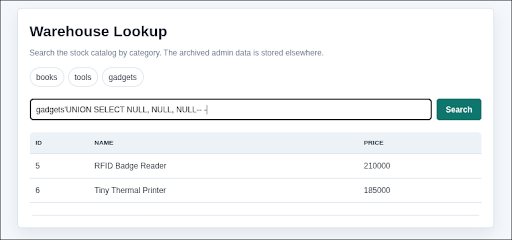
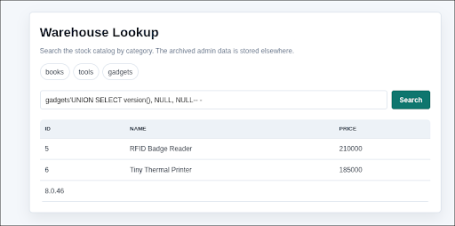
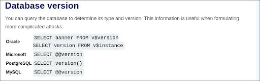
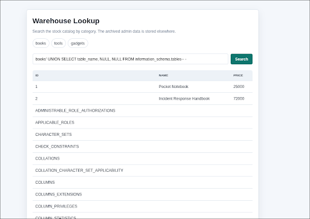
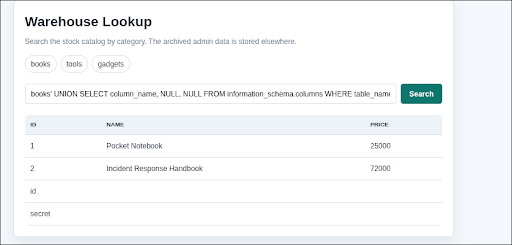
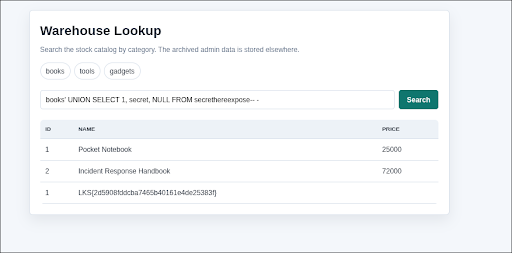

# WriteUp - wehhe1

## Overview

* **Name:** wehhe1
* **Category:** Web Exploitation
* **Point:** 500
* **Author:** Aseng
* **Desc:** The wirehouse catalog looks boring, but maybe there is something interesting in the database?.
* **URL:** [http://13.250.8.136:8001/](http://13.250.8.136:8001/)

## Summary
* **SQLI**
* **SQLI leak all of in database**

## Attack Idea:
Based on the clues provided, there are indications of an SQL or LFI vulnerability.
I tried to inject an SQLi payload:
> 

Here, I have entered the value of the logical OR expression 1 = 1, which always evaluates to TRUE. As this condition is always true, the application will treat the authentication as successful or retrieve all data from the database, without needing to know a valid username or password.

Next, we need to find out how many tables are available in the database:
> 

We can then identify the database type in order to determine the appropriate injection payload:
>   

As the server responded with a payload to check the database version of PostgreSQL, the server is using the PostgreSQL database.
You can find out how to check which version of the database is being used via this website: https://portswigger.net/web-security/sql-injection/cheat-sheet
> 

then input this payload:
````
' UNION SELECT table_name NULL, NULL FROM information_schema.tables-- -
````
>  

and we found a table: <br>
``
secrethereexpose
`` <br>
Next, we’ll move on to finding out what the table contains:
>  

It turned out to have ‘id’ and ‘secret’ columns; as I was suspicious of the ‘secret’ column, I then proceeded to ‘find out’ what was in that column.
> 

then PWN the flag.

<b> FLAG:
----
LKS{2d5908fddcba7465b40161e4de25383f} </b>
